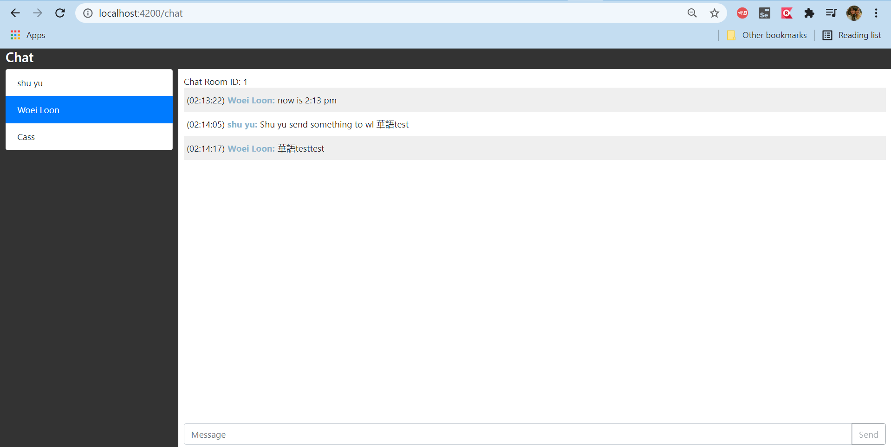
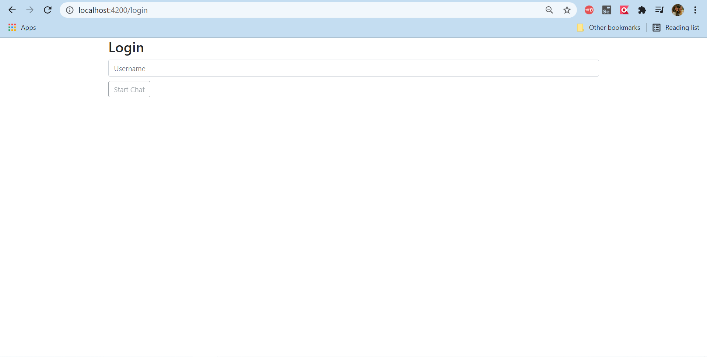

## How to start 
1. Build the project
2. Create tables by using the script in `sql` folder
3. start `simple-chat-application-rest` (PORT: 9001) and `simple-chat-application-websocket` (PORT: 9002)

## Screenshot 
1. Login screen  
    
   
2. Chat Screen  
    
